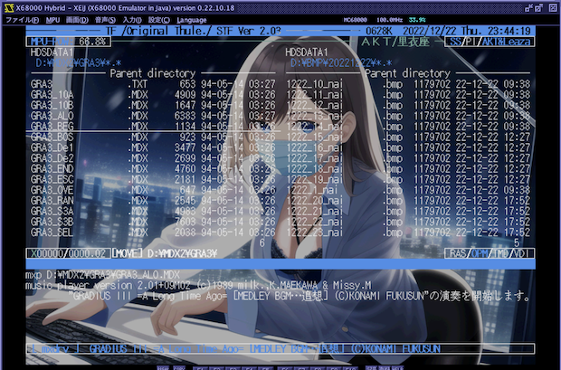

# bmpex
A simple BMP loader for X680x0/Human68k with XEiJ extended graphic support

シンプルな BMP ローダです。XEiJの拡張グラフィック画面に対応しており、最大で768x512x32768色のBMP画像を表示できます。

---

### インストール方法

BMPEXxxx.ZIP をダウンロードして展開し、BMPEX.X をパスの通ったディレクトリに置きます。

---

### 使用方法

    bmpex [オプション] <BMPファイル名>

      -v<n> ... 明るさ指定(1-100, default:100)
      -c    ... 画面クリアしてから表示します
      -s    ... 半分のサイズで表示します
      -e    ... XEiJ拡張グラフィックを使用します
      -h    ... ヘルプメッセージを表示します

060loadhigh.x を使ったハイメモリ上での実行に対応しています。

---

### Special Thanks

* XEiJ thanks to M.Kamadaさん
* xdev68k thanks to ファミべのよっしんさん
* HAS060.X on run68mac thanks to YuNKさん / M.Kamadaさん / GOROmanさん
* HLK301.X on run68mac thanks to SALTさん / GOROmanさん

---

### History

* 0.1.0 (2023/03/23) ... 初版
